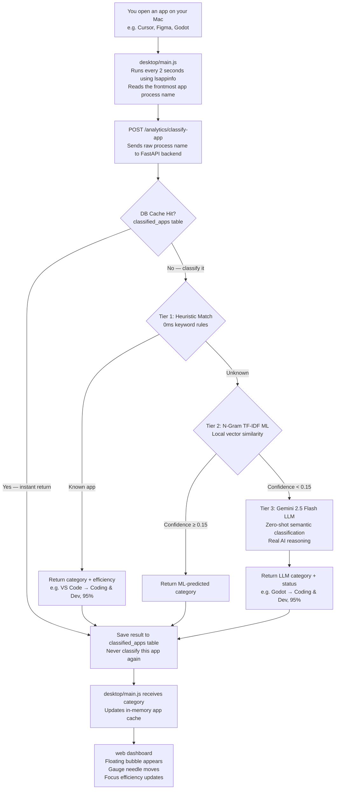

# 📘 Vita Focus Intelligence Studio — Complete System Guide

Welcome to the official system guide for **Vita**! This document explains how Vita works, how it was built, and how all its smart features — including zero-permission tracking, three-tier AI classification powered by Gemini 2.5 Flash, and a persistent learning cache — function behind the scenes, in clear and simple terms.

---

## 1. What is Vita? (The Big Picture)

Imagine having a smart personal assistant on your Mac that automatically knows when you are writing code in VS Code, designing in Figma, reading documentation in Safari, or listening to music on Spotify — without you clicking anything.

**Vita** is a macOS desktop app and web dashboard that:
1. **Tracks your active software automatically** in the background while you work.
2. **Uses a three-tier AI pipeline** to categorize every app — from lightning-fast keyword rules, to local ML, to Gemini 2.5 Flash for truly unknown apps.
3. **Calculates tailored focus efficiency scores** that differ per category (coding is not the same as entertainment).
4. **Presents a beautiful visual dashboard** with floating app bubbles, a live speedometer gauge, and a focus sprint timer.
5. **Remembers every classification forever** in a persistent PostgreSQL cache so the AI is only ever called once per unique app.

---

## 2. How Vita Works Under the Hood (Step-by-Step)

Here is the full journey of a single app open event — from your Mac screen to the dashboard:



---

## 3. How We Solved the macOS Permission Popup Problem

### ❌ The Problem With Normal Tracker Apps
Most Mac tracking apps use a system tool called AppleScript to check what app is on your screen. However, modern macOS versions (Ventura, Sonoma, Sequoia) treat AppleScript as intrusive and constantly pop up alert boxes saying:
> *"Vita wants access to Accessibility features. Open System Settings to allow."*

This is a terrible user experience and means the app requires manual permission granting before it can do anything.

### ✅ How We Solved It — Zero-Permission Tracking
We replaced AppleScript entirely with a **built-in macOS system binary** called `lsappinfo`:
```bash
/usr/bin/lsappinfo info -only name $(/usr/bin/lsappinfo front)
```

**Why this is a game-changer:**
| | AppleScript | lsappinfo (Vita's approach) |
|---|---|---|
| Permission popup | ❌ Always triggers | ✅ Never triggers |
| Works out of the box | ❌ Requires manual approval | ✅ Instant, no setup |
| CPU impact | Moderate | ~0% (near zero) |
| macOS compatibility | Breaking on Sequoia | ✅ All versions |

This runs inside `desktop/main.js` every **2 seconds** in a silent background loop, feeds the process name to the API, and updates the dashboard in real time.

---

## 4. The Three-Tier AI Classification Engine

This is the intellectual core of Vita. Every time you open a new app, it goes through up to three tiers of intelligence — from instant keyword rules to a live Gemini 2.5 Flash LLM call.

### 🗣️ Simple Explanation (Plain English)

Think of it like a **hiring process with three rounds** — cheaper and faster options go first, and you only escalate to the expert when truly needed.

**Round 1 — The Intern (Instant, Free)**
When you open `VS Code`, Vita literally just checks: *"Does the name contain 'vs code'? Yes → it's Coding & Dev."* That's it. A simple word match. Zero thinking, zero cost, 0ms. Works perfectly for 90% of apps people use daily.

**Round 2 — The Junior Employee (Fast, Free)**
If the app isn't on the known list, Vita tries to guess using math. It chops the app name into tiny letter pieces and compares them to patterns it knows. For example `"sublime"` → `su`, `ub`, `bl`... those pieces sound more like coding tools than music apps. It also returns a **confidence score** — if confidence is below 15%, it gives up and calls in the expert.

**Round 3 — The Expert (Slower, but Actually Smart)**
This is where **Gemini 2.5 Flash** (Google's AI) comes in. Vita sends it a message: *"I have a macOS app called 'Godot'. Which category is it?"* Gemini actually understands what Godot is (a game engine) and answers correctly: `Coding & Dev`. It can do this for literally any app ever made — even brand new ones nobody has heard of.

**The Smart Trick — The Cache**
The first time you open an unknown app like Godot, it takes ~500ms and costs a fraction of a cent. The result is saved to your database permanently. Every time after that, the answer comes back in **0ms** for free — already stored. Vita is self-learning: the more you use it, the faster it gets.

---

### Tier 1 — Fast Heuristic Match (0ms, Deterministic)

For all commonly known apps, Vita uses **instant keyword substring matching**. This runs in 0 milliseconds and requires no AI or network call.

```python
# From api/app/main.py — Tier 1 Heuristic Rules
if any(k in low for k in ["antigravity", "vs code", "xcode", "cursor", "windsurf",
                           "postman", "iterm", "warp", "ghostty", "docker", "orbstack"]):
    category, status, efficiency = "Coding & Dev", "Active Software Engineering", 95

elif any(k in low for k in ["figma", "sketch", "blender", "photoshop", "krita", "affinity"]):
    category, status, efficiency = "Design & UI", "Creative Design & UI Tokens", 90

elif any(k in low for k in ["safari", "chrome", "arc", "brave", "notion", "perplexity"]):
    category, status, efficiency = "Research & Docs", "Web Research & Technical Docs", 84

elif any(k in low for k in ["slack", "discord", "zoom", "telegram", "mail", "outlook"]):
    category, status, efficiency = "Communication", "Team Communication & Collaboration", 78

elif any(k in low for k in ["notes", "obsidian", "bear", "raycast", "todoist", "fantastical"]):
    category, status, efficiency = "Productivity", "Notes & Personal Organization", 85

elif any(k in low for k in ["spotify", "music", "vlc", "youtube", "netflix", "podcasts"]):
    category, status, efficiency = "Entertainment", "Background Audio & Streaming", 60
```

**When Tier 1 is enough:** For apps like VS Code, Figma, Slack, Spotify — it handles them instantly with zero latency and zero cost.

---

### Tier 2 — N-Gram TF-IDF Machine Learning Model (~1ms, Local)

When an app name doesn't match any Tier 1 keyword rule, Vita passes it to a **locally-running ML classifier** that uses character N-grams and TF-IDF vector similarity:

**Step-by-step how it works:**

1. **N-Gram Extraction**: Breaks the app name into sub-word character pieces.
   - `"sublime"` → `['su', 'ub', 'bl', 'li', 'im', 'me', 'sub', 'ubl', 'bli', 'lim', 'ime']`

2. **TF-IDF Vector**: Builds a frequency-weighted vector from the N-grams.

3. **Cosine Similarity**: Compares that vector mathematically against learned domain centroids using:

$$\text{Cosine Similarity} = \frac{\mathbf{A} \cdot \mathbf{B}}{|\mathbf{A}| \cdot |\mathbf{B}|}$$

4. **Confidence Threshold**: If the highest similarity score is **≥ 0.15**, the ML prediction is accepted. If it's below 0.15 (too uncertain), it escalates to Tier 3.

```python
# From api/app/main.py — Tier 2 ML Classifier
def ml_classify_app_domain(raw_name: str) -> tuple[str, float]:
    input_ngrams = extract_ngrams(raw_name)
    input_vector = compute_tfidf_vector(input_ngrams)

    best_domain, max_sim = "Productivity", -1.0

    for domain, centroid in ML_TFIDF_MODEL.items():
        dot = sum(input_vector.get(g, 0.0) * centroid.get(g, 0.0) for g in input_vector)
        sim = dot / (norm(input_vector) * norm(centroid)) if norms > 0 else 0.0
        if sim > max_sim:
            max_sim, best_domain = sim, domain

    return best_domain, max_sim  # (category, confidence score)
```

**Tier 2 limitation:** It was built on a manually curated keyword corpus — so short or truly novel app names (`Arc`, `Zed`, `Kiro`) may produce low-confidence scores and correctly escalate to Tier 3.

---

### Tier 3 — Gemini 2.5 Flash LLM (Real AI, ~400–800ms)

When both Tier 1 and Tier 2 fail to confidently classify an app, Vita makes a **live API call to Google's Gemini 2.5 Flash** model.

This is the only tier that uses **genuine semantic reasoning** — it can understand context, infer purpose from a name, and handle any app ever made, including apps released after the code was written.

#### 💰 What Does It Cost? (Plain English)

Gemini charges by **tokens** — basically, by the word. Our classification request sends about 150 words (the question) and gets back about 10 words (the answer).

| What | Tokens | Cost |
|---|---|---|
| Sending the app name + question | ~150 tokens | $0.000045 |
| Receiving the category answer | ~30 tokens | $0.000075 |
| **Total per unique new app** | — | **~$0.00012** |

To put that in perspective:
- **1,000 new apps classified** = **12 cents** total
- **You likely have fewer than 100 unique apps** installed on your Mac right now
- **Google's Free Tier** covers a daily quota of calls — for a personal tracker, you will almost certainly **never pay anything**
- After the first classification, the result lives in your database **forever** — the API is never called again for that app

```python
# From api/app/main.py — Tier 3 Gemini 2.5 Flash Classifier
def classify_with_gemini(app_name: str) -> tuple[str, str, int]:
    client = genai.Client(api_key=GEMINI_API_KEY)

    prompt = f"""You are classifying macOS application process names for a focus productivity tracker.

App process name: "{app_name}"

Classify into EXACTLY ONE of these 6 domains:
- Coding & Dev       → Code editors, terminals, developer tools, databases, compilers
- Design & UI        → Graphic design, 3D modeling, UI/UX prototyping, illustration
- Research & Docs    → Web browsers, documentation readers, PDF tools, knowledge bases
- Productivity       → Note-taking, task managers, calendars, writing tools
- Communication      → Team chat, email clients, video conferencing, messaging
- Entertainment      → Music players, video streaming, gaming, podcasts

Respond ONLY with a valid JSON object:
{{"category": "<exact domain>", "status": "<2-5 words describing what the app does>"}}"""

    response = client.models.generate_content(model="gemini-2.5-flash", contents=prompt)
    result = json.loads(response.text)
    return result["category"], result["status"], DOMAIN_EFFICIENCY[result["category"]]
```

**Real-world examples of what Tier 3 correctly handles:**

| App Name | Tier 1? | Tier 2? | Tier 3 Result |
|---|---|---|---|
| `Godot` | ❌ | ⚠️ low confidence | ✅ `Coding & Dev` — game engine |
| `Granola` | ❌ | ⚠️ | ✅ `Productivity` — AI meeting notes |
| `Windsurf` | ✅ (added) | — | `Coding & Dev` — AI code editor |
| `Kiro` | ❌ | ⚠️ | ✅ `Coding & Dev` — AI IDE |
| `Krita` | ✅ (added) | — | `Design & UI` — digital painting |

**Graceful degradation:** If `GEMINI_API_KEY` is not set, the function silently returns `"Productivity"` as a safe fallback. Nothing breaks.

---

### Persistent DB Cache — The `classified_apps` Table

Every single classification result — regardless of which tier produced it — is saved to a dedicated **PostgreSQL table** called `classified_apps`.

```python
# From api/app/models.py — ClassifiedApp persistent cache model
class ClassifiedApp(Base):
    __tablename__ = "classified_apps"

    app_name: Mapped[str] = mapped_column(String(200), primary_key=True)
    category: Mapped[str] = mapped_column(String(100), nullable=False)
    status: Mapped[str] = mapped_column(String(200), nullable=False)
    efficiency: Mapped[int] = mapped_column(Float, nullable=False)
    tier: Mapped[str] = mapped_column(String(20))      # "heuristic", "tfidf", or "llm"
    confidence: Mapped[float] = mapped_column(Float)
    classified_at: Mapped[datetime] = mapped_column(DateTime(timezone=True))
```

**Why this matters:**
- The very first time `Godot` is opened, Gemini classifies it in ~400ms.
- Every time after that, the answer is served from the database in **0ms** — no API call, no cost, no latency.
- The cache survives server restarts, container rebuilds, and deployments.
- Vita **learns and gets faster over time** as you use more apps.

The endpoint checks the DB cache first, before running any tier:
```python
cached = db.query(ClassifiedApp).filter(ClassifiedApp.app_name == raw).first()
if cached:
    return AppClassifyResponse(...)  # Instant return, zero computation
```

---

## 5. Tailored Focus Efficiency Scores

### Why One Number Is Wrong
Coding in VS Code demands intense deep focus. Listening to Spotify in the background does not. Treating both as the same efficiency score makes no sense.

### The Efficiency Matrix
Vita automatically assigns efficiency ratings based on the domain of work:

| Focus Domain | Type of Work | Efficiency |
| :--- | :--- | :---: |
| 🛠️ **Coding & Dev** | Deep software engineering, terminals, databases | **95%** |
| 🎨 **Design & UI** | Creative visual design, UI prototyping, 3D | **90%** |
| 📝 **Productivity** | Note-taking, planning, calendars, writing | **85%** |
| 📚 **Research & Docs** | Web research, documentation, PDF reading | **84%** |
| 💬 **Communication** | Team chat, email, video calls | **75%** |
| 🎵 **Entertainment** | Music, streaming, podcasts, gaming | **60%** |

### Category-Specific Display
When you expand a focus category card in the dashboard, the efficiency shown is **specific to that category** — not your global average. The calculation applies a sprint boost when a focus timer is active for that category.

### Zero-Baseline Principle
On a brand-new or purged account, all metrics display `0%` and `0.0 hrs`. There are no fake pre-filled numbers anywhere.

---

## 6. The Web Dashboard & UI Features

The frontend is built with **Next.js 16** and **Tailwind CSS**, with a soft cyan glassmorphic aesthetic (`#e4e7e4` canvas background, soft glass cards, cyan accent system).

### 6.1 Floating App Bubbles (Orbital Canvas)
- On a fresh account: zero bubbles appear. A friendly badge displays: *"Listening for active software... Focus any app on your Mac to show nodes."*
- As you use apps, glowing bubbles float around the central timer dial, each showing their percentage of your tracked time (e.g. `38%`).
- Bubble size scales with your time allocation.

### 6.2 Activity Nature Filter Button
- Located to the right of the central focus dial.
- **Turns solid black** when active, with a white icon — matching the style of the Focus Sound button.
- **Opens a popover** filtered by activity nature (Coding, Design, Research, etc.) that renders on the right side so it never overlaps the sidebar.
- **Click-outside to close**: clicking anywhere outside the popover dismisses it automatically.

### 6.3 Speedometer Gauge & Focus Score Arc
- The needle position is calculated mathematically from your daily focus hours vs. your target.
- On a fresh account, the needle sits at 0 and the arc is empty.
- As you complete focus sessions, it curves and fills in real time.

### 6.4 Focus Sprint Timer
- Sit-and-focus timer for 25-minute Pomodoro-style sessions.
- When a sprint completes, the efficiency score is calculated dynamically based on the sprint duration (not a static hardcoded value).
- Results are saved to the `focus_sessions` table.

### 6.5 Right Intelligence Panel (Focus Sound & Insights)
- **Focus Sound button**: plays ambient concentration audio. Turns solid black when active.
- **AI Insights panel**: slides out from the right. Displays your top focus domain, session history, and peak flow state badge.

### 6.6 Delete Account & Data Purge
- Located in Settings → *"Purge & Delete All Data"*.
- Opens a glassmorphic confirmation modal.
- Permanently deletes your profile, focus history, tasks, and classified app cache from the database, then redirects to sign-in.

---

## 7. Infrastructure & Project Structure

```
/MyProjects/Vita
├── .env                        # GEMINI_API_KEY and other secrets (git-ignored)
├── docker-compose.yml          # Orchestrates api, web, and postgres containers
│
├── desktop/                    # Electron App (macOS native layer)
│   ├── main.js                 # lsappinfo telemetry loop, in-memory app cache
│   └── preload.js              # Secure IPC bridge between desktop & web UI
│
├── api/                        # FastAPI Backend (Python AI + REST API)
│   ├── requirements.txt        # Dependencies: fastapi, sqlalchemy, google-genai
│   └── app/
│       ├── main.py             # All endpoints + 3-tier AI classifier + Gemini call
│       ├── models.py           # DB models: User, FocusTask, FocusSession, ClassifiedApp
│       ├── schemas.py          # Pydantic validation schemas
│       ├── auth.py             # JWT authentication + bcrypt password hashing
│       └── database.py         # PostgreSQL connection via SQLAlchemy
│
└── web/                        # Next.js 16 Web Dashboard
    └── src/app/(dashboard)/
        └── dashboard/page.tsx  # Main dashboard: bubbles, gauge, graphs, timer, panels
```

### Docker Services
```yaml
# docker-compose.yml — three services
services:
  db:   postgres:16       # Persistent PostgreSQL database
  api:  vita-api          # FastAPI backend on :8000
  web:  vita-web          # Next.js dashboard on :3000
```

The `GEMINI_API_KEY` is passed from the host `.env` file into the `vita_api` container as an environment variable — never hardcoded.

---

## 8. API Endpoint Reference

| Method | Endpoint | What It Does |
|---|---|---|
| `POST` | `/auth/signup` | Create a new user account |
| `POST` | `/auth/login` | Log in and receive a JWT token |
| `GET` | `/users/me` | Fetch current authenticated user profile |
| `DELETE` | `/users/me` | Purge account and all associated data |
| `POST` | `/analytics/activity` | Record an app open event from the desktop |
| `POST` | `/analytics/classify-app` | **Three-tier AI classifier** — returns category, efficiency, status |
| `GET` | `/analytics/summary` | Aggregated focus stats for the dashboard |
| `GET` | `/focus/tasks` | Fetch all focus tasks for the user |
| `POST` | `/focus/tasks` | Create a new focus task |
| `PATCH` | `/focus/tasks/{id}` | Update a focus task |
| `DELETE` | `/focus/tasks/{id}` | Delete a focus task |
| `POST` | `/focus/sessions` | Record a completed focus sprint session |
| `GET` | `/focus/sessions` | Fetch all past focus sessions |

---

## 9. Quick Start Commands

```bash
# Run everything with Docker (recommended)
docker compose up -d

# Or run each service individually:

# FastAPI backend:
cd api && uvicorn app.main:app --reload --port 8000

# Next.js web dashboard:
cd web && npm run dev

# Electron desktop app:
cd desktop && npm run dev
```

### Setting Up Gemini API Key (Required for Tier 3 LLM)

1. Get a free key at **https://aistudio.google.com/apikey**
2. Open `.env` at the project root
3. Replace the placeholder:
```bash
GEMINI_API_KEY=AIzaSy...your_real_key_here
```
4. Restart the API container:
```bash
docker compose restart api
```

> **Without the key:** Vita still works perfectly. Unknown apps silently fall back to Tier 2 TF-IDF. Tier 3 activates gracefully only when a valid key is present.

---

## 10. How the Three Tiers Compare

| | Tier 1 — Heuristics | Tier 2 — TF-IDF ML | Tier 3 — Gemini LLM |
|---|---|---|---|
| **Speed** | 0ms | ~1ms | ~400–800ms |
| **Cost** | Free | Free | Free tier / ~$0.00012 paid |
| **Known apps** | ✅ Perfect | ✅ Good | ✅ Yes |
| **Novel app names** | ❌ Fails | ⚠️ Weak signal | ✅ Strong semantic reasoning |
| **Ambiguous names** | ❌ Fails | ❌ Random | ✅ Understands context |
| **Requires internet** | No | No | Yes |
| **After first call** | DB cache (0ms) | DB cache (0ms) | DB cache (0ms) |
