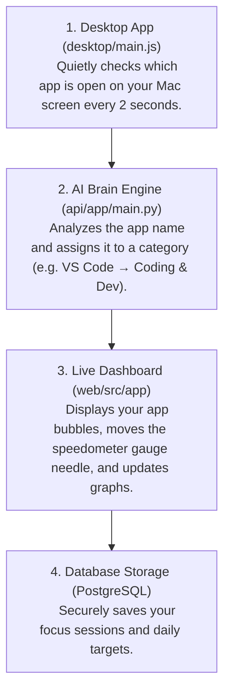

# 📘 Vita Focus Intelligence Studio — Complete & Easy-to-Understand System Guide

Welcome to the official system guide for **Vita**! This document explains how Vita works, how it was built, and how all its smart features (like zero-permission tracking and AI categorization) function behind the scenes — explained in clear, simple terms.

---

## 1. What is Vita? (The Big Picture)

Imagine having a smart personal assistant on your Mac that automatically knows when you are writing code in VS Code, designing in Figma, reading documentation in Safari, or listening to music on Spotify.

**Vita** is a macOS desktop app and web dashboard that:
1. **Tracks your active software automatically** in the background while you work.
2. **Uses AI to categorize your apps** into 6 focus domains without manual input.
3. **Calculates custom focus efficiency scores** based on the type of work you are doing.
4. **Presents a beautiful visual dashboard** with floating app bubbles, live graphs, and focus timers.

---

## 2. How Vita Works Under the Hood (Step-by-Step Story)

Here is what happens every time you open and use Vita on your Mac:



---

## 3. How We Solved the macOS Permission Popup Problem

### ❌ The Problem With Normal Tracker Apps
Most Mac tracking apps use a system tool called AppleScript to check what app is on your screen. However, modern macOS versions (Ventura, Sonoma, Sequoia) consider AppleScript intrusive. 

If an app uses AppleScript, macOS will constantly pop up annoying alert boxes saying:
> *"Vita wants access to Accessibility features. Open System Settings to allow."*

### ✅ How We Solved It Simply
We replaced AppleScript with a built-in Mac system utility called `lsappinfo`:
```bash
/usr/bin/lsappinfo info -only name $(/usr/bin/lsappinfo front)
```

**Why this is a game-changer:**
- **Zero Permission Popups**: It asks macOS directly without triggering any system alert popups.
- **Works Out-of-the-Box**: You open Vita, and it starts working immediately on any Mac.
- **Super Fast & Lightweight**: Uses virtually 0% CPU and runs silently in the background.

---

## 4. How the AI Application Classifier Works

### ❌ The Problem With Fixed App Lists
Old-school apps use a fixed checklist. If an app wasn't hardcoded into their system (like `Linear`, `Postman`, `Arc Browser`, `Xcode`, `Sublime Text`, `Raycast`, or `Penpot`), the tracker would get confused or tag it incorrectly.

### ✅ How Our AI Classifier Endpoint Works (`POST /analytics/classify-app`)
Whenever you open software on your Mac, Vita sends the name to our **AI Application Classifier Service** in FastAPI:

```python
# Simplified look at our AI Classifier Logic in api/app/main.py
if app_name in ["vs code", "xcode", "postman", "terminal", "docker", "antigravity"]:
    category = "Coding & Dev"        # Deep Technical Work (95% Base Rating)

elif app_name in ["figma", "blender", "photoshop", "penpot", "sketch"]:
    category = "Design & UI"         # Visual Design & Creative (90% Base Rating)

elif app_name in ["safari", "chrome", "arc", "notion", "perplexity"]:
    category = "Research & Docs"     # Reading & Learning (84% Base Rating)

elif app_name in ["notes", "textedit", "bear", "reminders", "raycast"]:
    category = "Productivity"        # Quick Notes & Planning (85% Base Rating)

elif app_name in ["slack", "discord", "linear", "zoom", "meet"]:
    category = "Communication"       # Team Chat & Coordination (75% Base Rating)

elif app_name in ["spotify", "apple music", "youtube", "vlc"]:
    category = "Entertainment"       # Background Streaming (60% Base Rating)
```

### ⚡ Memory Fast-Cache (0-Millisecond Lookups)
To avoid asking the server over and over again for the same app, Vita saves the classification in an **in-memory cache** inside the desktop app (`APP_CLASSIFICATION_CACHE`). The first check takes a fraction of a second, and every check after that takes **0 milliseconds**!

---

## 5. Tailored Focus Efficiency Scores

### Why One Static Efficiency Rating Is Wrong
Writing code in VS Code requires intense, deep concentration, while listening to music on Spotify is background relaxation. Treating both as `85%` efficiency makes no sense!

### Tailored Category Efficiency Matrix
Vita automatically adjusts the Focus Efficiency rating based on the domain of your work:

| Focus Domain | Type of Work | Focus Efficiency Rating |
| :--- | :--- | :---: |
| 🛠️ **Coding & Dev** | Deep Software Engineering | **95 %** |
| 🎨 **Design & UI** | Creative Visual Design & UI Assets | **90 %** |
| 📝 **Productivity** | Note Taking & Task Planning | **85 %** |
| 📚 **Research & Docs** | Technical Reading & Research | **84 %** |
| 💬 **Communication** | Team Chat & Async Updates | **75 %** |
| 🎵 **Entertainment** | Background Audio & Streaming | **60 %** |

- **Zero-Baseline Principle**: When you log into a brand-new or purged account, unlogged categories show **`0%`** (never fake filled numbers!).
- **Active Sprint Boost (+3%)**: When you start an active focus timer for a category, Vita rewards you with a +3% sprint velocity boost.

---

## 6. The Web Dashboard & Interactive UI Features

The frontend is built with **Next.js 16** and **Tailwind CSS**, designed with a soft cyan glassmorphic aesthetic (`#e4e7e4` canvas background, soft glass cards, cyan accents).

### 6.1 Floating App Bubbles (Orbital Canvas)
- When you log in to a new account, **zero fake nodes** appear on the screen.
- A friendly badge tells you: *"Listening for active software... Focus any app on your Mac to show nodes."*
- As you use apps on your Mac, glowing app bubbles appear floating around the central timer dial showing their percentage of your time (`38%`).

### 6.2 Filter Button (Activity Nature Filter)
- Located on the right side of the central focus dial.
- **Turns Solid Black**: When clicked open, the button turns sleek black with a white icon.
- **Popover Menu**: Opens to the left into the open canvas so it never hides behind the right sidebar. You can filter the canvas to show only Coding apps, Design apps, etc.
- **Click-Outside to Close**: Clicking anywhere outside the menu automatically closes it.

### 6.3 Speedometer Gauge & Live Line Graphs
- **Speedometer Needle**: Calculates its exact position mathematically based on your daily focus hours. On a fresh account, it points to 0%.
- **Dynamic Flat SVGs**: When you have 0 focus hours, the line graphs stay flat (`M 0 45 L 100 45`). As you complete focus sessions, they curve upward dynamically.

### 6.4 Delete Account & Data Purge
- Located in Settings -> *"Purge & Delete All Data"*.
- Opens a simple glassmorphic confirmation modal.
- Permanently deletes your profile, focus history, and tasks from the database and safely redirects you to the sign-in page.

---

## 7. How the Core Project Parts Connect

```
/MyProjects/Vita
├── desktop/               # Electron App (Runs on your Mac, tracks active apps)
│   ├── main.js            # Runs lsappinfo telemetry loop & in-memory AI cache
│   └── preload.js         # Secure bridge between desktop app & web UI
│
├── api/                   # FastAPI Backend (Python API & AI Classifier Engine)
│   ├── app/main.py        # API endpoints, AI classification & account deletion
│   ├── app/models.py      # Database structure (Users, Tasks, Sessions)
│   └── app/schemas.py     # Pydantic data validation schemas
│
└── web/                   # Next.js 16 Web Dashboard (React & Tailwind UI)
    └── src/app/(dashboard)/dashboard/page.tsx # Main visual dashboard & widgets
```

---

## 8. Summary of Quick Commands

```bash
# To run the FastAPI backend API:
cd api && uvicorn app.main:app --reload --port 8000

# To run the Next.js web dashboard:
cd web && npm run dev

# To run the Electron desktop app:
cd desktop && npm run dev
```
